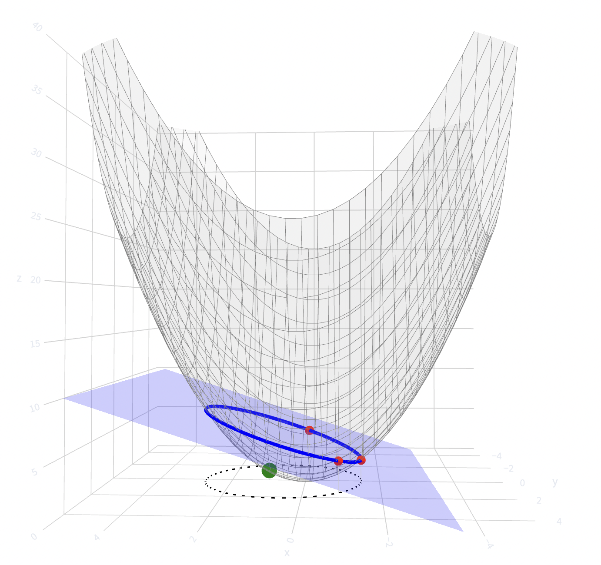
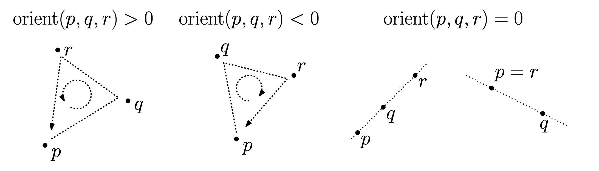
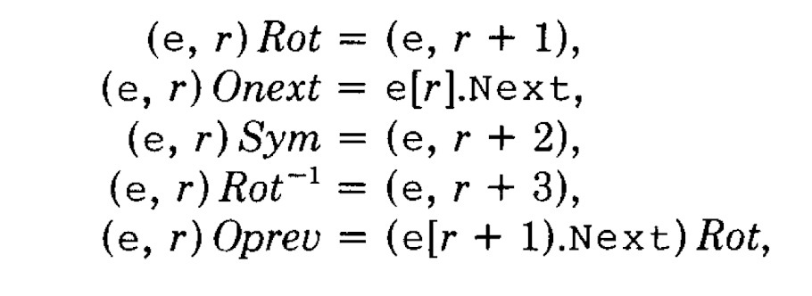
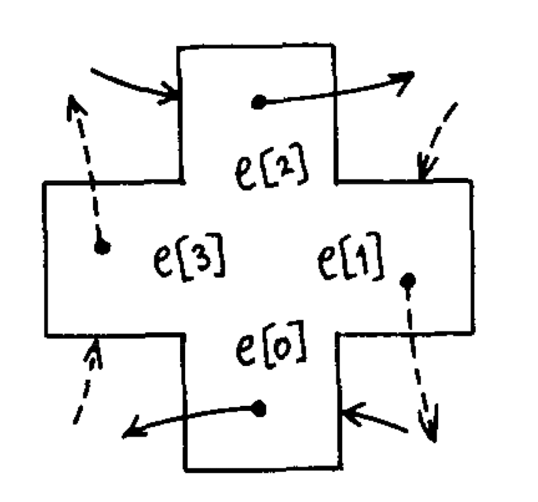
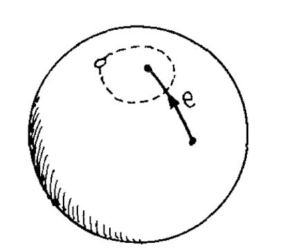

import Pseudocode from '../../components/Pseudocode.astro';

The goal of this article is to illustrate an implementation of Delaunay triangulation in java.
The implementation follows the work of Leonidas Guibas and Jeorge Stolfi, on their original paper they introduce this new data structure called QuadEdge that allows to interact with a graph and it's dual, something that is incredibly useful for computing Delaunay triangulation.
I will explain the theory behind the Delaunay triangulation and then I will introduce the key operators of the data structure I will use to implement this algorithm.
In the end, I will show you a working implementation of the algorithm used for computing a minimum spanning tree, with complexity $O(n\log n)$.
In fact, one of the many properties of the Delaunday triangulation, is that every edge of the minimum spanning tree is already in the triangulation.
This allows us to not go through all the possible edges like using naively the algorithms of Prism or Kruskal.

### Delaunay Triangulation and the Empty Circumcircle

In computational geometry, a **Delaunay Triangulation** for a set of points $P$ is a triangulation such that no point in $P$ is inside the circumcircle of any triangle in the triangulation. This specific structure maximize the minimum angle of all the angles of the triangles in the triangulation, effectively avoiding "sliver" or skinny triangles. This leads to the fundamental property used to construct these meshes:

$\textbf{Proposition.}$
A triangle abc is in the Delaunay triangulation, if and only if the circumcircle of this triangle contains no other site in its interior.

$\textbf{Lemma.}$
Consider four distinct points $p,q,r,s \in \mathbb{R}^2$, and let
$p^\uparrow, q^\uparrow, r^\uparrow, s^\uparrow$ denote their vertical lifts onto the surface

$$\Psi := \{(x,y,z) \in \mathbb{R}^3 \mid z = x^2 + y^2\}.$$

Then the point $s$ lies inside the circumcircle of the triangle $\triangle pqr$ if and only if $s^\uparrow$ lies strictly below the plane passing through $p^\uparrow, q^\uparrow,$ and $r^\uparrow$.

### Proof:

Let $\Psi$ be the surface defined by

$$z = x^2 + y^2 .$$

Its partial derivatives are

$$
\frac{\partial z}{\partial x} = 2x,
\qquad
\frac{\partial z}{\partial y} = 2y 
$$

At a point $(a,b,a^2+b^2) \in \Psi$, the tangent plane $\Pi$ is given by

$$z = 2a(x-a) + 2b(y-b) + a^2 + b^2,$$

which simplifies to

$$\Pi:\quad z = 2ax + 2by - (a^2 + b^2).$$

Now, here comes the crucial part, if we shift the plane, that in this moment intersect the paraboloid in only one point by a constant $r^2$, why we are doing this will be clear in a moment.
Then we will get:

$$z = 2ax + 2by - (a^2 + b^2) +r^2$$

This is the same plane as before shifted by a constant.
How does this plane intersect $\Psi$?
We have defined $z=x^2+y^2$ so we just plug it into the formula, and we get:

$$x^2+y^2 = 2ax + 2by - (a^2 + b^2) +r^2$$

If we bring to the left some terms, and complete the square we get:

$$
(x-a)^2+(y-b)^2=r^2
$$

This is just the equation of a circle, so the projection on the xy-plane of the intersection of a plane with a paraboloid is just a circle, with the radius squared equal to how much we shift the plane to the z-axis.
Let's see this better by a graph, in grey there is the paraboloid which is intersected by the blue plane, that represents the shifted plane.
The intersection of the shifted plane to the paraboloid creates an ellipse in 3d, when projected into the xy axis, the ellipse becomes a circle.
As you can see in the image, for a fourth point to stay inside the circumference created by the other three red points, the lifted green point must stay below the plane.
It comes naturally the conclusion that when the lifted green point will stay on the blue plane, it's going to be exactly on the circumference as the other three red points.

To reveal the full essence of the in circle test, we have yet another tool to analyse, in principle we could just compute this test:
take three points, lift them up, take the plane that passes through them, and see if another lifted point is below the plane.
But there is a more analytical way, underling the same principle in a more elegant way, using an orientation test.

$\textbf{Orientation test}$
Given an ordered triple of points $(p, q, r)$ in the plane, we say that they have **positive orientation** if they define a counterclockwise oriented triangle, **negative orientation** if they define a clockwise oriented triangle, and **zero orientation** if they are collinear, which also includes the case where two or more of the points are identical.

Note that the orientation depends on the order in which the points are given.

Orientation is formally defined by the area of this determinant of the points given in homogeneous coordinates.

$$
\text{Orient}(p, q, r) =
\det
\begin{pmatrix}
1 & p_x & p_y \\
1 & q_x & q_y \\
1 & r_x & r_y
\end{pmatrix}
$$

### Using the Sign for the "In-Circle" Test

Just as the 2D orientation determinant tells you if a point is "left" or "right" of a line, the following determinant tells you if the lifted point $S'$ is "above" or "below" the plane defined by $P', Q', R'$.

Assuming $p, q, r$ are sorted in a counter-clockwise order:

- **Positive Determinant $(>0)$:** The point $s$ is **inside** the circumcircle. (The lifted point $S'$ is below the plane defined by the other three).

- **Negative Determinant $(<0)$:** The point $s$ is **outside** the circumcircle. (The lifted point $S'$ is above the plane).

$$
\text{orient}(\vec{p}, \vec{q}, \vec{r}, \vec{s}) = \text{inCircle}(p,q,r,s) = \operatorname{sign} 
\det
\begin{pmatrix}
p_x & p_y & p_x^2 + p_y^2 & 1 \\
q_x & q_y & q_x^2 + q_y^2 & 1 \\
r_x & r_y & r_x^2 + r_y^2 & 1 \\
s_x & s_y & s_x^2 + s_y^2 & 1
\end{pmatrix}.
$$

Wether the point s lies above or below the oriented plane is determined by this orientation test.

# Quad edge structure

The QuadEdge structure, is a structure made of 4 parts, able to easily navigate between the graph and it's dual.
My implementation of data structure will be made using java, for this reason, I'm going to use references instead of pointers used in the original paper.

The QuadEdge class represent four QuarterEdge, each one represents:
- an edge,
- its reverse,
- the dual edge,
- the reverse dual.

### Navigation in this system

let $r \in [0,3]$ indicates which edge you are referring to.
These are the fundamental methods

Each edge is connected to the four immediately adjacent ones `ONext`, `OPrev`, `DNext`, `DPrev`.
The strenght of the quad-edge data structure is that has **uniform access to the dual and mirror-image sundivisions** of the graph.

This image represents clearly the structure and explain the definition.
The solid arrows are the direction of the **primal** edge, the dashed arrows are the direction of the **dual** edge.
The black dots are the origin of that quarter edge, all together for the same geometric edge.

**Each rotation swaps primalß and dual**, moving counter clockwise in the plane.
This is why rot moves one step in the vector.
Sym moves to the other side, so it moves two positions, while the **inverse rot** three positions.

The Quad-edge stores only one topological pointer, that is `ONext`, everything else must be derived from it.
`Oprev` is "previous edge around a vertex", implemented by temporarily rotating into the dual, walking forward, and rotating back.
## Topological operators:

The two key topological operators are `MakeEdge` and `Splice`, those are the only two fundamental topological operators, all the others will be implemented with them.

### Make edge

Create a subdivision of the sphere.
$e$ will be the only edge of the subdivision and will not be a loop.
This is the result of makeEdge.

## Splice
Take as parameters two edges $a$ and $b$, returning no value.
This operator affects the two edge rings $a.Org$ and $b.Org$ and independently, the two edge rings $a.Left$, $b Left$.

1) If the two rings are distinct, splice will combine them into one.

2) If the two are exactly the same ring, splice will break it in two separate pieces.

3) If the two are the same ring taken with opposite orientations, splice will flip (and reverse the order) of a segment of that ring.

It's possible to prove, that only by using Splice and MakeEdge, any simple subdivision S can be constructed.

$e.Org$ is equal to $e.Data$
$e.Dest$ is equal to $e.Sym.Org$

## List Higher operators

Here follows a list of higher topological operators derived from the fundamental two, the implementation is exactly how Leonidas Guibas and Jeorge Stolfi described them in the paper.
### Connect\[a,b\]

Will add a new edge $e$ connecting the destination of $a$ to the origin of $b$.
<Pseudocode>
<pre class="pseudocode-item">
{`
\\begin{algorithm}
    \\caption{Connect[a,b]}
    \\begin{algorithmic}
      \\Procedure{Connect}{a,b}
        \\state e ← MakeEdge[];
        \\state e.Org ← a.Dest;
        \\state e.Dest ← b.Org;
        \\State Splice[e, a.Lnext];
        \\State Splice[e.Sym, b]
      \\EndProcedure
    \\end{algorithmic}
\\end{algorithm}
`}
</pre>
</Pseudocode>

### DeleteEdge\[e\]

<Pseudocode>
<pre class="pseudocode-item">
{`
\\begin{algorithm}
    \\caption{DeleteEdge[e]}
    \\begin{algorithmic}
      \\Procedure{DeleteEdge}{e}
        \\State Splice[e, e.Oprev];
        \\State Splice[e.Sym, e.Sym.Oprev];
      \\EndProcedure
    \\end{algorithmic}
\\end{algorithm}
`}
</pre>
</Pseudocode>

### Swap\[e\]
<Pseudocode>
<pre class="pseudocode-item">
{`
\\begin{algorithm}
    \\caption{Swap[e]}
    \\begin{algorithmic}
      \\Procedure{Swap}{e}
        \\state a ← e.Oprev;
        \\state b ← e.Sym.Oprev;
        \\State Splice[e, a];
        \\State Splice[e.Sym, b];
        \\State Splice[e, a.Lnext];
        \\State Splice[e.Sym, b.Lnext];
        \\State e.Org ← a.Dest;
        \\State e.Dest ← b.Dest;
      \\EndProcedure
    \\end{algorithmic}
\\end{algorithm}
`}
</pre>
</Pseudocode>

## RightOf and LeftOf

These procedures uses the CCW test described above.
The CCW test, implemented using the determinant showed before, is frequently used to test whether a **point** **X** lies to the right or to the left of the line of a given edge $e$.

<Pseudocode>
<pre class="pseudocode-item">
{`
\\begin{algorithm}
    \\caption{RightOf[X,e]}
    \\begin{algorithmic}
      \\Procedure{RightOf}{X, e}
        \\Return CCW[X, e.Dest, e.Org]
      \\EndProcedure
    \\end{algorithmic}
\\end{algorithm}
`}
</pre>
</Pseudocode>

<Pseudocode>
<pre class="pseudocode-item">
{`
\\begin{algorithm}
    \\caption{LeftOf[X,e]}
    \\begin{algorithmic}
      \\Procedure{LeftOf}{X, e}
        \\Return CCW[X, e.Org, e.Dest]
      \\EndProcedure
    \\end{algorithmic}
\\end{algorithm}
`}
</pre>
</Pseudocode>

## Valid

**A valid edge is above the basel**, so to test wheter the edge is valid or not we call the procedure:
$RightOf[e.Dest, basel]$

## Divide and conquer algorithm

Finally the algorithm to construct this triangulation, there are different methods to do it.
The one showed in the paper is a divide and conquer algorithm.
There are also incremental algorithms to construct a triangulation when you don't have yet all the points, in that case the complexity of the algorithm is $O(n \log n)$ in high probability.

In the Divide and conquer algorithm, one recursively draws a line to split the vertices into two sets (divide). The Delaunay triangulation is computed for each set, and then the two sets are merged (conquer) along the splitting line. Using some clever tricks, the merge operation can be done in time $O(n)$, so the total running time is $O(n log n)$.

Here follows the pseudocode of the algorithm.
It handles the termination conditions where the subset of points $S$ is small enough to be solved trivially:

Case $\|S\|=2$: It creates a single edge connecting the two points ($s_1 \to s_2$) and returns it.

Case $\|S\|=3$: It connects the sorted points into a chain ($s_1 \to s_2 \to s_3$). It then tests the geometric orientation (`CCW`) to decide how to close the triangle. If the points form a triangle (not collinear), it adds a third closing edge.

Crucially, the function returns a specific pair of edges---typically the **Left-most** and **Right-most** edges of the convex hull formed by these points. These return values are essential for the subsequent "Merge" step, allowing the algorithm to efficiently identify where to start stitching the left and right sub-triangulations together.

<Pseudocode>
<pre class="pseudocode-item">
{`
\\begin{algorithm}
    \\caption{DelaunayTriangulation(P)}
    \\begin{algorithmic}
      \\Procedure{Delaunay}{S}
          \\state //s1, s2 are two sites, in sorted order, Create an edge a from s1 to s2:
        \\If{|S| = 2}
            \\state s1, s2 ← S[0], S[1]
            \\state a ← MakeEdge()
            \\state a.Org ← s1
            \\state a.Dest ← s2
            \\Return  (a, a.Sym)

          \\Elif{|S| = 3}
            \\state //let s1,s2,s3 be the three sides, in sorted order
            \\state //Create edges a connecting s1 to s2 and b connecting s2 to s3
            \\State s1, s2, s3 ← S[0], S[1], S[2]

            \\State a ← MakeEdge()
            \\State  b ← MakeEdge()
            \\State  Splice(a.Sym, b)

            \\State  a.Org ← s1
            \\State  a.Dest ← s2
            \\State  b.Org ← s2
            \\State  b.Dest ← s3
            \\State //now close the triangle
          \\If{CCW(s1, s2, s3)}
              \\State c ← Connect(b, a)
              \\state RETURN (a, b.Sym)
            \\Elif{CCW(s1, s3, s2)}
              \\state c ← Connect(b, a)
              \\state RETURN (c.Sym, c)
            \\Else
              \\state // Collinear points
              \\state RETURN (a, b.Sym)
          \\EndIf
          \\Else
            \\state (ldo, ldi) ← Delaunay(L)
            \\state (rdi, rdo) ← Delaunay(R)
            \\state //compute the lower common tangent of L and R
          \\While{True}
            \\if{LeftOf(rdi.Org, ldi)}
              \\state ldi ← ldi.Lnext
            \\Elif{RightOf(ldi.Org, rdi)}
              \\state rdi ← rdi.Rprev
            \\Else
            \\Break
          \\EndIf
        \\EndWhile
          \\state //create first cross edge
          \\state basel ← Connect(rdi.Sym, ldi)
        \\if{ldi.Org = ldo.Org}
          \\state ldo ← basel.Sym
      \\EndIf

      \\if{rdi.Org = rdo.Org}
        \\state rdo ← basel
      \\EndIf

        \\state //Merge Loop

      \\While{True}
          \\state lcand ← basel.Sym.Onext
        \\if{Valid(lcand)}
        \\While{InCircle(basel.Dest,
          basel.Org,
          lcand.Dest,
          lcand.Onext.Dest)}
            \\state t ← lcand.Onext
            \\state DeleteEdge(lcand)
            \\state lcand ← t
        \\EndWhile

      \\EndIf

        \\state // locate first right candidate
        \\state rcand ← basel.Oprev
      \\If{Valid(rcand)}
        \\While{InCircle(
          basel.Dest,
          basel.Org,
          rcand.Dest,
          rcand.Oprev.Dest
          )}
            \\state t ← rcand.Oprev
            \\state DeleteEdge(rcand)
            \\state rcand ← t

        \\EndWhile

      \\EndIf
        \\state //if both invalid, basel is upper tangent

      \\If{!Valid(lcand) \\And !Valid(rcand)}
        \\Break
      \\EndIf

        \\state // Choose next cross edge
      \\If{!Valid(lcand) \\Or (Valid(rcand) \\And InCircle(
        lcand.Dest,
        lcand.Org,
        rcand.Org,
        rcand.Dest
        ))}
          \\state basel ← Connect(rcand, basel.Sym)
        \\Else
          \\state basel ← Connect(basel.Sym, lcand.Sym)
      \\EndIf
      \\EndWhile

        \\Return(ldo,  rdo)
      \\EndIf

      \\EndProcedure
    \\end{algorithmic}
\\end{algorithm}
`}
</pre>
</Pseudocode>

The merge loop is the crucial parte where you have two separate meshes (Left and Right) that need to be stitched together without creating any overlapping or "illegal" triangles.

### Logic of merge loop

1.  **Start at the Bottom (Lower Tangent):** The algorithm finds the lowest possible connection between the two sides that doesn't intersect anything. This is the starting "bridge."

2.  **Climb Upwards (The Candidate Search):** From the current bridge, it looks at the next available point on the Left and the Right to see which one is a better fit to extend the mesh upward.

3.  **Fix Mistakes (The Circle Test):** Before connecting to a point: "If I connect here, does the resulting triangle obey the Delaunay rule?"

    - **If No:** It **deletes** the conflicting edge on that side to make room.
    - **If Yes:** It creates a new cross-edge and moves up.
      This repeats until it reaches the top (Upper Common Tangent).

You can find the working code in java [here](https://github.com/dreaazy/Delaunay-Triangulation).

### Properties of Delaunay Triangulation

After all this, why is useful doing this, it seems incredibly complicated? Is it worth computing?
The Delaunay Triangulation has a lot of interesting properties, but the one that interests the most is for computing EMST.

The Euclidean Minimum Spanning Tree (EMST) of a set of points is a **subgraph** of the Delaunay Triangulation of those same points.

If you try to build an MST on a set of $N$ points directly, you have to consider the "Complete Graph" (every point connected to every other point). This graph has $O(N^2)$ edges. Running Kruskal's or Prim's algorithm on this dense graph takes **$O(N^2)$** time, which is too slow for large datasets.

Because the MST is guaranteed to be *inside* the Delaunay Triangulation, you don't need to look at all possible edges. You only need to look at the Delaunay edges.
The Delaunay Triangulation is a planar graph, meaning it only has **$O(N)$** edges (specifically, at most $3N-6$).

For this reason, if our total algorithm is as follows:
1. Compute Delaunay Triangulation: **$O(N \log N)$**
2. Run Kruskal's/Prim's on *only* the Delaunay edges: **$O(N \log N)$**

Then the total algorithm complexity is $O(n \log n)$, an incredibly faster solution than the naively solution that would take $O(n^2)$

### Compute MST

In my implementation I used the Kruskal's Algorithm from the delauday edges.
I used a disjoint set to avoid loops, the DSU solves this by giving every group of edges a representative id, to check if two points are connected, you just look at their id, this takes constant time.

<Pseudocode>
<pre class="pseudocode-item">
{`
\\begin{algorithm}
    \\caption{ComputeMST}
    \\begin{algorithmic}
      \\Procedure{ComputeMST}{hull}
        \\state // 1. Collect all unique edges from the Delaunay triangulation
        \\state S ← CollectEdges[hull];

        \\state // 2. Sort edges by length (ascending)
        \\state L ← Sort[S, length];

        \\state // 3. Initialize MST and Disjoint Set Union (DSU)
        \\state T ← emptyset;
        \\state sumWeight ← 0;
        \\state DSU ← InitDSU[];

        \\state // 4. Apply Kruskal's Algorithm
        \\For{$e \\in L$}
          \\state u ← e.Org;
          \\state v ← e.Dest;

          \\If{DSU.Find[u] $\\neq$ DSU.Find[v]}
            \\state DSU.Union[u, v];
            \\state T.add[e];
            \\state sumWeight ← sumWeight + Distance[u, v];
          \\EndIf
        \\EndFor

        \\Return (T, sumWeight);
      \\EndProcedure
    \\end{algorithmic}
\\end{algorithm}
`}
</pre>
</Pseudocode>

## References

- Primitives for the Manipulation of General Subdivisions and the Computation of Voronoi Diagrams, [PDF](http://www.sccg.sk/~samuelcik/dgs/quad_edge.pdf)  
- Quad Edge constructor operators - Stanford [PDF](https://graphics.stanford.edu/courses/cs348a-17-winter/ReaderNotes/handout31.pdf)  
- Delaunay Triangulation (chapter 9), Elisha Sacks, [PDF](https://www.cs.purdue.edu/homes/cs53100/slides/delaunay.pdf)  
- Determinants and Volumes , [PDF](https://textbooks.math.gatech.edu/ila/determinants-volumes.html)
